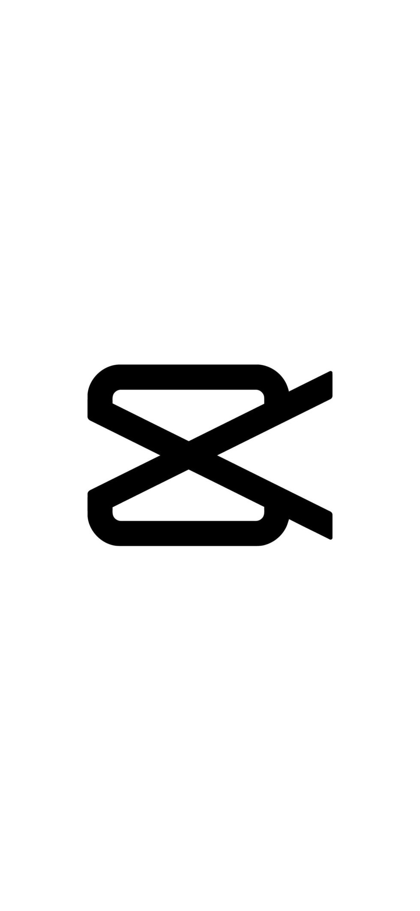

# JOCAM — Vidéaste & Créateur de Contenu

Bienvenue dans le dépôt du portfolio de **JOCAM**, une expérience web cinématique haut de gamme conçue pour mettre en avant l'expertise en montage vidéo et création de contenu.



## 🌟 Expérience Visuelle

Ce portfolio n'est pas qu'un simple site vitrine, c'est une narration interactive basée sur le défilement (scroll-driven experience) :

-   **Overlay Shutter Cinématique** : Dès l'ouverture, un effet d'obturateur vidéo crée une immersion immédiate, s'effaçant délicatement pour révéler le contenu.
-   **Animation iPhone 13 Mini 3D** : Le cœur de l'expérience est un modèle 3D d'iPhone qui réagit au scroll à travers 6 phases distinctes :
    -   Zoom macro sur les lentilles de la caméra.
    -   Dézoom pour révéler le design global.
    -   Rotation fluide du dos vers la face avant.
    -   Activation de l'écran avec affichage progressif de contenus (CapCut logo, timeline, interfaces de montage).
    -   Passage spectaculaire en mode paysage ("Effet WOW") pour une immersion totale.
    -   Finalisation avec une rotation lente à 360°.
-   **Design Premium** : Une palette de couleurs sobre (Beige, Noir, Or), une typographie élégante (*Bebas Neue*, *DM Serif Display*) et des micro-animations de curseur peaufinent l'aspect haut de gamme.

## 🛠️ Stack Technique

Le projet repose sur des technologies web modernes sans framework lourd, privilégiant la performance et la fluidité :

-   **Frontend** : HTML5 sémantique, CSS3 (Flexbox/Grid, animations complexes, Glassmorphism).
-   **Logic** : JavaScript (ES6+).
-   **Animations** : Mappage manuel de la progression du scroll pour synchroniser parfaitement les transformations 3D sans dépendances externes lourdes (similaire à GSAP ScrollTrigger).
-   **Assets** : Images haute résolution optimisées et vidéo nativement intégrée.

## 📂 Structure du Projet

```text
├── index.html          # Structure principale et contenu du portfolio
├── style.css           # Design système et animations complexes
├── script.js           # Logique de navigation, curseur personnalisé et animation 3D
├── adjust_img.py       # Utilitaire de traitement d'images (format 9:19.5)
└── assets/             # Vidéos, mockups iPhone et captures d'écran
```

## 🚀 Utilisation Locale

1. Clonez le dépôt.
2. Ouvrez `index.html` dans votre navigateur (ou utilisez une extension comme *Live Server* sur VS Code).
3. Scrollez pour vivre l'expérience cinématique.

## ✉️ Contact

Développé pour la vision de **JOCAM**. Pour toute demande de collaboration, utilisez le formulaire de contact intégré en bas de page.

---
*Optimisé pour le storytelling visuel et la fluidité mobile.*
